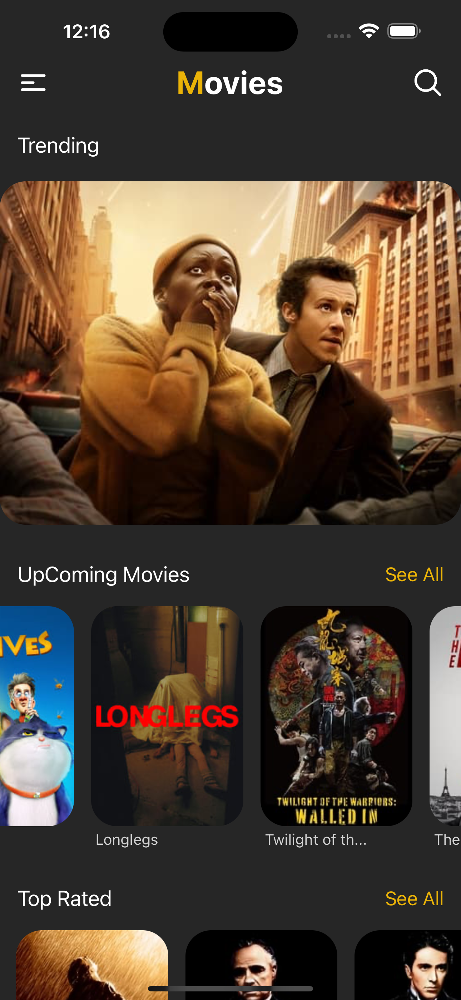
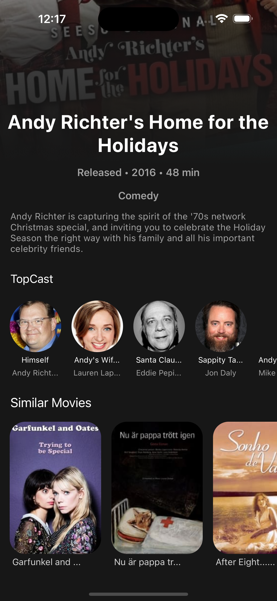
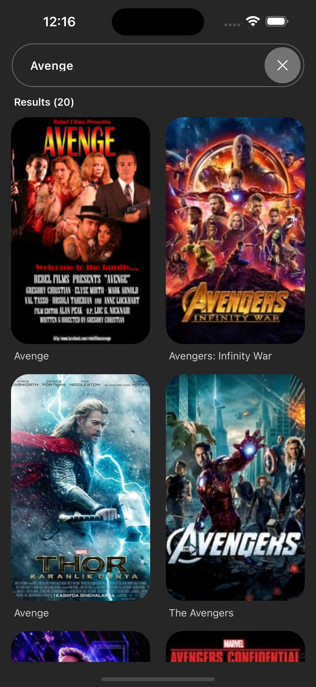
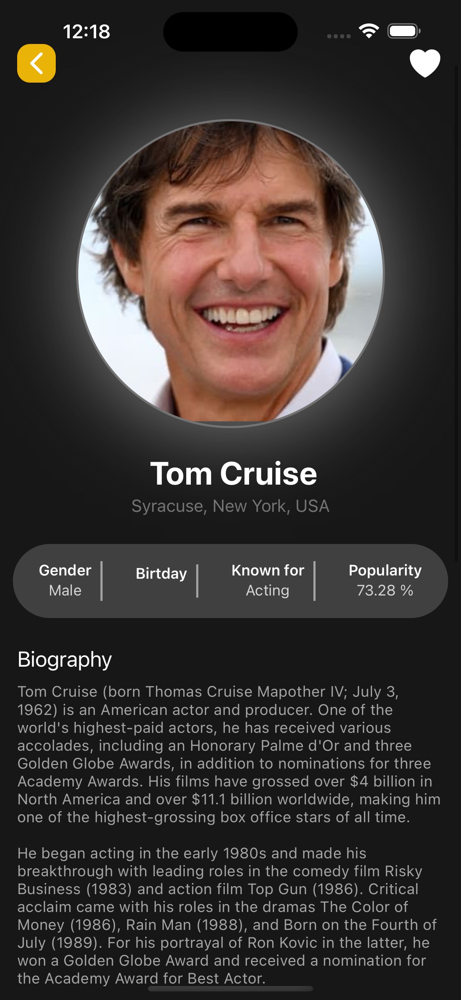

# movieApp - React Native Expo Application

## Project Name: movieApp

## Platform: React Native - Expo

## Project Description

movieApp is a user-friendly mobile application that allows you to explore popular movies and TV shows, access detailed information, and discover similar content. Users can view trending movies and TV shows, explore cast details, read actor biographies, and find recommendations based on their preferences.

## Video gif


## Home Screen



## Movie Screen



## Search Screen



## Person Screen



## Features

- Trending Movies and TV Shows: Users can browse popular movies and TV shows.
- Detailed Information: View descriptions, cast details, and other relevant information about each movie or TV show.
- Actor Biographies: Access detailed biographies of actors featured in the movies and TV shows.
- Similar Movies: Discover movies similar to the ones you’ve watched.
- Search Functionality: Easily search for specific movies or TV shows.
- User-Friendly Interface: Clean and intuitive UI optimized for mobile devices.
- Linear Gradient: Enhanced visual aesthetics with gradient backgrounds.
- Icon Usage: Stylish and meaningful icons integrated using react-native-heroicons.
- Debounce Functionality: Prevent unnecessary API calls during search operations using debounce.

## Technologies and Lİbraries Used

- React Native: Framework for building native mobile applications.
- Expo: Toolchain for developing and testing React Native applications quickly.
- React Native Wind: Tailwind CSS-like utility for rapid and flexible styling.
- React Native Reanimated Carousel: High-performance and flexible carousel component.
- Axios: HTTP client for making API requests.
- Lodash.debounce: Utility to control the rate of function executions.
- react-native-heroicons: Modern and customizable icons.
- react-native-linear-gradient: Library for creating gradient backgrounds.
- TMDb API: API for fetching movie and TV show data.

## Requirements

To run this project locally, you will need:

- Node.js: Download Node.js
- Expo CLI:

```
npm install -g expo-cli
```

- React Native CLI: (Ensure development environment is set up for iOS and Android)
- iOS: Xcode
- Android: Android Studio

## Installation

- Clone the project to your local machine:
  git clonehttps://github.com/ozerbaykal/movieApp-react-native-expo.git

- Navigate to the project directory:

```
cd movieApp-react-native-expo
```

- Install the necessary packages:

```
npm install
```

- Set Up API Key: Obtain an API key from TMDb. Create a .env file in the root directory and add your API key:

```
TMDB_API_KEY=your_api_key_here

```

### Starting the Development Server

```
npm start

```

- Run on Emulator or Device:

### Use an Android or iOS emulator.

- Use an Android or iOS emulator.
- Alternatively, scan the QR code with your physical device using the Expo Go app.
  Libraries Used

<h2>Contributing</h2>

Contributions are welcome! Please open an issue first to discuss what you would like to change.

- 1.Fork the project
- 2.Create your feature branch (git checkout -b feature/NewFeature)
- 3.Commit your changes (git commit -m 'Add new feature')
- 4.Push to the branch (git push origin feature/NewFeature)
- 5.Open a Pull Request

<h2>Contact</h2>

Özer BAYKAL mail : baykalozer87@gmail.com

Project Link: https://github.com/ozerbaykal/movieApp-react-native-expo/tree/main
